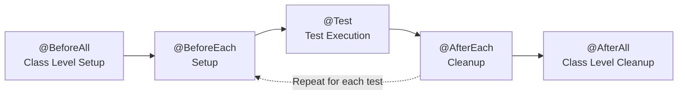

## 17. JUnit

> [!abstract] Коротко
> JUnit — основной фреймворк для написания и запуска автотестов в Java.


**JUnit** — основной фреймворк для написания и запуска автотестов в Java.

JUnit отвечает за:

* объявление тестов;
* запуск тестовых методов;
* подготовку и очистку тестовых данных;
* группировку тестов;
* проверки результата через assertions;
* параметризованные тесты.

---

### 17.1. Жизненный цикл теста в JUnit 5

Типичный жизненный цикл одного тестового метода:

1. JUnit находит тестовый класс.
2. Создает экземпляр тестового класса.
3. Выполняет методы `@BeforeEach`.
4. Выполняет тестовый метод `@Test`.
5. Выполняет методы `@AfterEach`.
6. Фиксирует результат: passed, failed, skipped.

Если в классе есть общая подготовка:

1. Перед всеми тестами один раз выполняется `@BeforeAll`.
2. Затем для каждого теста выполняется цикл `@BeforeEach -> @Test -> @AfterEach`.
3. После всех тестов один раз выполняется `@AfterAll`.

Схема жизненного цикла:



Как читать схему:

1. `@BeforeAll` выполняется один раз перед всеми тестами класса.
2. Для каждого теста повторяется цепочка `@BeforeEach -> @Test -> @AfterEach`.
3. `@AfterAll` выполняется один раз после всех тестов класса.

---

### 17.2. Основные аннотации JUnit 5

| Аннотация | Для чего нужна |
| --- | --- |
| `@Test` | Помечает метод как тест |
| `@BeforeEach` | Выполняется перед каждым тестом |
| `@AfterEach` | Выполняется после каждого теста |
| `@BeforeAll` | Выполняется один раз перед всеми тестами класса |
| `@AfterAll` | Выполняется один раз после всех тестов класса |
| `@DisplayName` | Задает читаемое имя теста |
| `@Disabled` | Временно отключает тест |
| `@Nested` | Позволяет группировать тесты во вложенных классах |
| `@ParameterizedTest` | Помечает параметризованный тест |
| `@ValueSource` | Передает набор простых значений в параметризованный тест |
| `@CsvSource` | Передает набор значений в формате CSV |
| `@MethodSource` | Берет данные для теста из метода |
| `@Tag` | Помечает тест тегом для фильтрации запуска |

---

### 17.3. Как размещать аннотации в тестах

Аннотации JUnit ставятся над методами тестового класса.

Обычно структура такая:

1. `@BeforeAll` — метод общей подготовки перед всеми тестами.
2. `@BeforeEach` — метод подготовки перед каждым тестом.
3. `@Test` — сам тестовый метод.
4. `@AfterEach` — очистка после каждого теста.
5. `@AfterAll` — общая очистка после всех тестов.

Полный пример:

```java
import org.junit.jupiter.api.AfterAll;
import org.junit.jupiter.api.AfterEach;
import org.junit.jupiter.api.BeforeAll;
import org.junit.jupiter.api.BeforeEach;
import org.junit.jupiter.api.DisplayName;
import org.junit.jupiter.api.Test;

import static org.junit.jupiter.api.Assertions.assertEquals;

class CalculatorTest {

    private Calculator calculator;

    @BeforeAll
    static void beforeAll() {
        System.out.println("Выполняется один раз перед всеми тестами");
    }

    @BeforeEach
    void setUp() {
        calculator = new Calculator();
        System.out.println("Выполняется перед каждым тестом");
    }

    @Test
    @DisplayName("Складывает два числа")
    void shouldAddTwoNumbers() {
        int result = calculator.sum(2, 3);

        assertEquals(5, result);
    }

    @Test
    @DisplayName("Вычитает два числа")
    void shouldSubtractTwoNumbers() {
        int result = calculator.subtract(5, 2);

        assertEquals(3, result);
    }

    @AfterEach
    void tearDown() {
        System.out.println("Выполняется после каждого теста");
    }

    @AfterAll
    static void afterAll() {
        System.out.println("Выполняется один раз после всех тестов");
    }
}
```

Порядок выполнения будет таким:

```text
@BeforeAll
    @BeforeEach
        @Test shouldAddTwoNumbers
    @AfterEach

    @BeforeEach
        @Test shouldSubtractTwoNumbers
    @AfterEach
@AfterAll
```

---

### 17.4. Разбор примера

| Аннотация | Где стоит | Что делает |
| --- | --- | --- |
| `@BeforeAll` | Над `static void beforeAll()` | Выполняется один раз перед всеми тестами класса |
| `@BeforeEach` | Над `void setUp()` | Создает новый `Calculator` перед каждым тестом |
| `@Test` | Над тестовыми методами | Говорит JUnit, что метод нужно запустить как тест |
| `@DisplayName` | Над тестовым методом | Задает понятное имя теста в отчете |
| `@AfterEach` | Над `void tearDown()` | Выполняет очистку после каждого теста |
| `@AfterAll` | Над `static void afterAll()` | Выполняется один раз после всех тестов класса |

Важно: в JUnit 5 методы `@BeforeAll` и `@AfterAll` обычно делают `static`, потому что они выполняются на уровне класса.

---

### 17.5. Что важно сказать на скрининге

JUnit — это фреймворк для написания и запуска тестов в Java. Тестовые методы помечаются `@Test`. Подготовка перед каждым тестом делается через `@BeforeEach`, очистка после каждого теста — через `@AfterEach`. Общая подготовка и очистка для всего класса делаются через `@BeforeAll` и `@AfterAll`. Аннотации ставятся над методами тестового класса и управляют порядком выполнения теста.
---

## Связанные заметки

- [[00 - Индекс|Индекс]]
- [[16 - Работа со строками|Предыдущая заметка]]
- [[18 - Selenide|Следующая заметка]]
